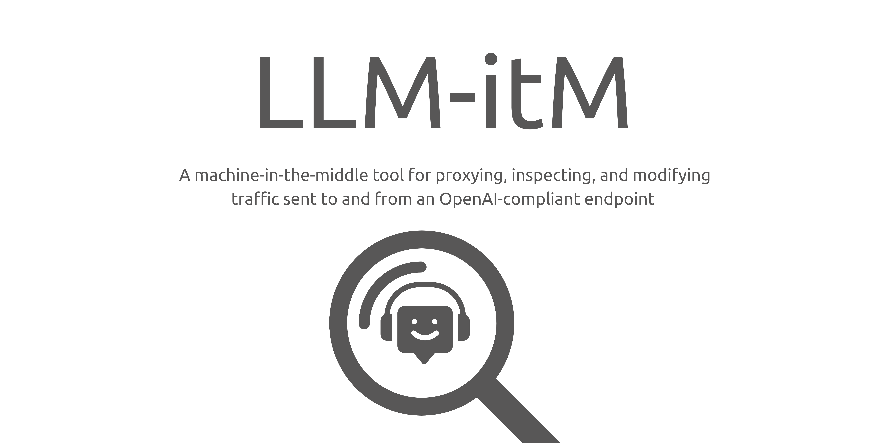
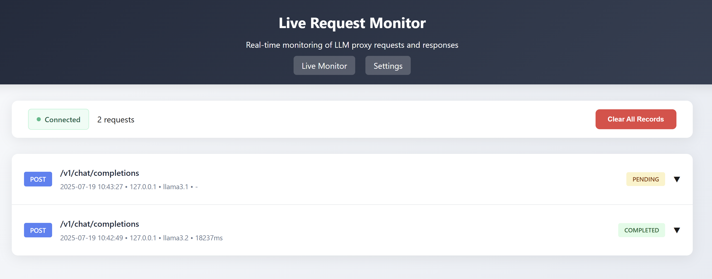

<p align="center">
    
</p>
<p align="center">A machine-in-the-middle tool for proxying, inspecting, and modifying traffic sent to and from an OpenAI-compliant endpoint</p>

<div align="center">


</div>

A lightweight proxy server that sits between your applications and LLM APIs (Ollama, OpenAI, etc.), providing configurable request/response processing modules and a web-based configuration interface. Customisable via a port 80 settings page. 

## Installation & Setup

1. **Install Dependencies**:
   ```bash
   pip install -r requirements.txt
   ```

3. **Run the Server**:
   ```bash
   python app.py
   ```

2. **Configure LLM Provider** (choose one):

- `--host`  
  LLM API base URL (default: `http://localhost:11434/v1` for Ollama)

- `--api-key`  
  API key for the LLM service (default: `None` for Ollama)

- `--listen-host`  
  Host to bind the proxy server to (default: `0.0.0.0`)

- `--listen-port`  
  Port to bind the proxy server to (default: `5000`)

- `--debug`  
  Enable debug mode


4. **Configure Settings and View Traffic**:
   - Open `http://localhost:5000` in your browser
   - Enable/disable modules, adjust settings, and view traffic

## Usage

Point your applications to the proxy instead of the LLM directly - an example can be seen in ```simple_interface.py```:

**Base URL Default:** `http://localhost:5000/v1`

**Example with OpenAI Python library:**
```python
import openai

client = openai.OpenAI(
    api_key="your_api_key",  # or "ollama" for local Ollama
    base_url="http://localhost:5000/v1"
)

response = client.chat.completions.create(
    model="gpt-3.5-turbo",  # or "llama3.1" for Ollama
    messages=[{"role": "user", "content": "Hello!"}]
)
```

# Modules
Modules are used for modifying LLM requests to the API and for modifying responses coming from the API. An example ```pirate_mode``` module is provided in this repository that changes the API request and response message, however, all parts of the request can be modified if required. This module adds ```Respond like a pirate``` to every request and adds ```[Told to respond like a pirate]``` to the end of every response. When viewing the requests in the browser you can see requests and responses before and after modules were applied. 

Below shows running the API and ```simple_interface.py``` with an OpenAI endpoint using the ```pirate_mode``` module:


Below shows the same server running with the module disabled:


This can also be done for a variety of LLM types and endpoints as seen below for an Ollama server running locally calling llama3.2 and llama3.1:



# Contributing

Contributions to Folly are welcome! Please see the [Contributing Guidelines](CONTRIBUTING.md) for more information.

# License

See the [LICENSE](LICENSE) file for details.
